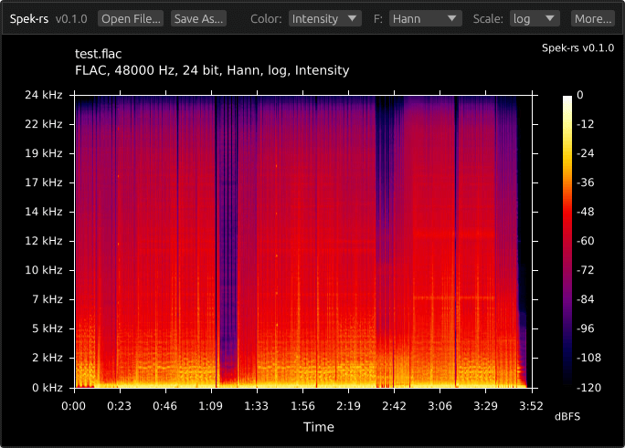

# spek-rs
Spek alternative written in Rust. The program is used to create spectrograms of audio files. It uses FFmpeg for audio decoding (like the original) and [egui](https://github.com/emilk/egui) for the GUI.

The main difference from the original is that the legend around the spectrogram is also created by FFmpeg, which makes it look a bit worse. So, basically, this program is a simple GUI for FFmpeg's spectrogram generation feature. I built this since the original Spek appears to be unmaintained, and installing it from the AUR was often problematic.

## TODO
- [x] Save and load settings from a configuration file
- [ ] Add keyboard shortcuts
- [ ] Draw captions at the top of the image like original
- [ ] Custom legend rendering
